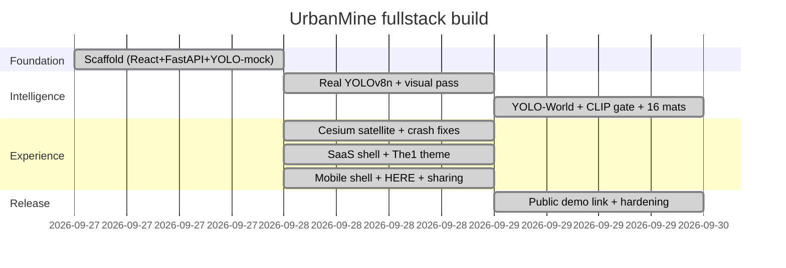

# project-fullstack — UrbanMine codebase document

Complete source, framework, and decision record for the UrbanMine B2B
demolition-reuse marketplace (MVP). Measured snapshot: 13 tracked source files,
2,300 lines, ~128 KB of code (excluding dependencies, model weights, uploads).
Live demo (anonymous, expires): https://civic-tundra-3mt8.here.now/

## 1. Project snapshot

UrbanMine lets demolition contractors photograph a site, get AI-identified
reusable materials with quantities, publish one-click marketplace listings, and
match with buyers (architects, builders, designers) by a weighted score, ending
in requests and an impact dashboard. Stack: React 18 + Vite 5 frontend,
Python FastAPI backend, YOLO-World + YOLOv8n + CLIP vision, JSON store
(PostGIS-ready), CesiumJS satellite globes, HERE/Nominatim geocoding, here.now
static hosting with a tunneled API.

## 2. Framework decisions — why this, not MERN and the rest

**Why not MERN.** MERN keeps one language, but UrbanMine's hardest problem is
vision AI, which lives in Python (torch, ultralytics, transformers, PIL,
numpy). FastAPI covers the thin API layer (CRUD, scoring, uploads) while
Pydantic matches Express-side validation; shelling Python out of Node would
only add latency and failure modes.

**Why not Mongo.** Matching is geo-first, and PostgreSQL + PostGIS answers
radius queries (`ST_DWithin`, GiST indexes) in single-digit milliseconds plus a
real relational ledger for requests. The MVP runs a JSON file with identical
haversine math so rankings survive migration (SQL in README section 9).

**Why React (Vite), not Next.js.** Dashboard with no SEO needs and heavy
client media (photos, WebGL). Vite gives instant HMR and a dependency-free
static build for here.now; no router — five tabs of conditional render.

**Why Cesium, not MapLibre/Leaflet.** Satellite-first presentation with an ion
upgrade path and one `createViewer` helper for both globes. Cost on 1.119:
constructor imagery options are ignored and `removeAll()` strands tiles, so
layers attach post-construction via async factories; the labels overlay was
dropped after it crashed rendering. MapLibre + Deck.gl stays the alternative
for thousand-point datasets.

**Why YOLO-World + YOLOv8n + CLIP, not training.** No labeled demolition
dataset exists, so open-vocabulary prompts (~50 phrases, materials + negatives)
beat day-one training; v8n covers COCO objects, numpy estimates bulk coverage,
CLIP crop-gates household false positives. Training segmentation (YOLOv8-Seg,
RT-DETR) is the call once real site photos accumulate.

**Why HERE with Nominatim fallback.** Search must work keyless (Nominatim,
rate-limited) and scale keyed (HERE, India-biased); one helper pair owns the
chain, the UI only sees a source tag.

**Why here.now.** Frontend builds to static files, so anonymous hosting gives a
shareable URL in seconds; the backend stays tunneled (`VITE_API_BASE` baked at
build). Permanent hosting needs an account key; the tunnel needs this machine.

## 3. Source map

```
urbanmine/
  README.md                         310 lines   Full review doc (flows, API, runbook, decisions)
  PROJECT-FULLSTACK.md              this file
  docker-compose.yml                 15 lines   Optional PostGIS 16-3.4 (user/pass/db urbanmine)
  docs/urbanmine-flow.excalidraw.json           10-node MVP flow diagram (editable)
  backend/
    main.py                         738 lines   All API routes, vision, scoring, store
    requirements.txt                 13 lines   fastapi, uvicorn, multipart, pydantic,
                                                ultralytics, pillow, numpy, transformers
    data.json                       auto        JSON store (6 seeded Bengaluru listings)
    uploads/                        auto        Analyzed photos, served at /uploads
  frontend/
    index.html                       16 lines   Cesium pinned CDN + display/mono fonts
    vite.config.js                   18 lines   :5173, /api+/uploads proxy, HTTPS=1 SSL
    package.json                     23 lines   react, react-dom, gsap, exifr
    .env.example                                CESIUM_TOKEN / TILES_ASSET_ID /
                                                HERE_KEY / VITE_API_BASE
    src/main.jsx                      6 lines   React root, global CSS
    src/App.jsx                     590 lines   Shell + 5 panels + API consumers
    src/LocationPicker.jsx          266 lines   Coordinate-free picker + mini-globe
    src/cesium.js                   130 lines   Token, createViewer, flyTo, setPins
    src/styles.css                  175 lines   The1 tokens, cards, dropzone, a11y
```

Key symbols. main.py: `MATERIAL_META` (16 materials), `FULL_QTY`,
`COCO_TO_MATERIAL`, `WORLD_PROMPTS` (~40) / `WORLD_NONCON`, `yolo_infer` /
`world_infer` (hits + others + boxes), `visual_estimate` (color + fabric +
condition), `clip_check` (0.60 gate, fail-open), `detect_materials` (merge,
100% shares, site verdict), `match_score` (40/25/20/15), `qty_for`,
`haversine_km`, `downscale_for_ai`, schemas + 13 routes. App.jsx: `API`,
`TABS`, `useIsMobile`, desktop/mobile shells, `UploadPanel` (EXIF, shrink,
auto-analyze, publish, non-construction list), `MarketPanel`, `MatchPanel`,
`RequestsPanel`, `ImpactPanel`, `MATERIAL_PAINT`, `fmtINR`. LocationPicker:
`AREAS` (12 presets), `geoSearch`/`geoReverse` (HERE-first), tap + draggable
pin. cesium.js: `createViewer` (Esri factory satellite, ion path, 3D tiles,
atmosphere), `flyTo`, `setPins`. styles.css: concrete/iron/paints, SF +
Condensed + Nerd, flat cards, a11y set.

## 4. Backend reference

Routes (base :8000, 404s are JSON `{"detail"}`): GET /api/health (adds
yolo/world flags, counts); POST /api/analyze (multipart file + lat/lng/address;
25MB cap, format gate, always JSON incl. `error` field); POST /api/listings;
GET /api/listings (material, condition, q, lat/lng/max_distance_km, nearest
first with distance_km); GET/PATCH /api/listings/{id}; POST /api/match
(quantity/condition/distance filters, top 20 by score); POST /api/requests;
GET /api/requests; PATCH /api/requests/{id} (accepted/declined/pending);
GET /api/impact (tonnes = qty x CO2 / 1000, value formatted lakh/Cr, matches =
43 seed + live requests); GET /api/materials (all 16, drives the dropdowns);
static /uploads; docs at /docs.

Detection pipeline per photo: downscale to 1280px (original stored untouched);
YOLO-World prompts (~40, conf 0.1) and YOLOv8n COCO (conf 0.25) emit material
hits with pixel boxes plus non-construction objects; numpy color/texture pass
emits bulk coverage plus a fabric detector and contrast-based condition; CLIP
verifies every box and the full frame (gate 0.60, strong COCO trusted,
fail-open); fabric frames suppress concrete/metal and skip fallback;
confidences normalize to 100% shares high to low; site verdict = kept YOLO
evidence or (passing frame + >=20% visual). Response: detections[] (material,
icon, quantity, unit, condition, confidence, share, price, source),
non_construction[] (label, count, confidence), is_construction_site, model.

## 5. Frontend reference

Shell: desktop sidebar + mission topbar; mobile (<=900px hook) gets brand bar +
bottom tabs + full-width CTAs. Same panels/APIs both shells; GSAP entrance
only, killed by prefers-reduced-motion. UploadPanel: dropzone + camera snap,
EXIF GPS, canvas shrink to 1600px JPEG (also fixes HEIC), auto-analyze
checklist, editable detections, publish, non-construction section, not-a-site
warning, inline errors with retry. LocationPicker: search, 12 presets, device
GPS, globe tap, draggable pin; reverse-geocodes every move; compact mode hides
the globe. Marketplace: location-driven filters, auto-reload, requests, pins,
camera follows buyer. Requests: accept/decline. A11y: skip link, tablist
roles, focus rings, alert/status regions, labelled globes.

## 6. Data flows

Upload to listing: photo -> EXIF GPS (or picker) -> shrink -> POST /api/analyze
-> edit detections -> POST /api/listings -> appears in Marketplace + match +
impact totals. Match: buyer need (material, qty, point, condition, radius) ->
POST /api/match -> scored rows with distance_km. Request: buyer identity +
listing -> POST /api/requests (pending) -> contractor PATCH accepted/declined.
Share build: tunnel backend -> build with VITE_API_BASE -> publish dist/ to
here.now (manifest, PUT bytes, finalize) -> link; anonymous links immutable
(no claim token issued) so each republish mints a new slug.

## 7. Build timeline



```json
{"type":"excalidraw","version":2,"source":"urbanmine-gantt","elements":[{"id":"t","type":"text","x":20,"y":14,"width":420,"height":30,"angle":0,"strokeColor":"#1f1f1f","backgroundColor":"transparent","fillStyle":"solid","strokeWidth":1,"strokeStyle":"solid","roughness":1,"opacity":100,"groupIds":[],"frameId":null,"roundness":null,"seed":1,"version":1,"versionNonce":1,"isDeleted":false,"boundElements":[],"updated":1,"link":null,"locked":false,"fontSize":22,"fontFamily":1,"text":"UrbanMine build timeline","textAlign":"left","verticalAlign":"middle","containerId":null,"originalText":"UrbanMine build timeline","autoResize":true,"lineHeight":1.25},{"id":"b1","type":"rectangle","x":20,"y":110,"width":190,"height":84,"angle":0,"strokeColor":"#1f1f1f","backgroundColor":"#fbb833","fillStyle":"solid","strokeWidth":2,"strokeStyle":"solid","roughness":1,"opacity":100,"groupIds":[],"frameId":null,"roundness":{"type":3},"seed":11,"version":1,"versionNonce":11,"isDeleted":false,"boundElements":[],"updated":1,"link":null,"locked":false},{"id":"t1","type":"text","x":30,"y":128,"width":170,"height":48,"angle":0,"strokeColor":"#1f1f1f","backgroundColor":"transparent","fillStyle":"solid","strokeWidth":1,"strokeStyle":"solid","roughness":1,"opacity":100,"groupIds":[],"frameId":null,"roundness":null,"seed":12,"version":1,"versionNonce":12,"isDeleted":false,"boundElements":[],"updated":1,"link":null,"locked":false,"fontSize":15,"fontFamily":1,"text":"1 Scaffold fullstack","textAlign":"center","verticalAlign":"middle","containerId":null,"originalText":"1 Scaffold fullstack","autoResize":true,"lineHeight":1.25},{"id":"b2","type":"rectangle","x":235,"y":110,"width":190,"height":84,"angle":0,"strokeColor":"#1f1f1f","backgroundColor":"#027b49","fillStyle":"solid","strokeWidth":2,"strokeStyle":"solid","roughness":1,"opacity":100,"groupIds":[],"frameId":null,"roundness":{"type":3},"seed":13,"version":1,"versionNonce":13,"isDeleted":false,"boundElements":[],"updated":1,"link":null,"locked":false},{"id":"t2","type":"text","x":245,"y":128,"width":170,"height":48,"angle":0,"strokeColor":"#d9d9d9","backgroundColor":"transparent","fillStyle":"solid","strokeWidth":1,"strokeStyle":"solid","roughness":1,"opacity":100,"groupIds":[],"frameId":null,"roundness":null,"seed":14,"version":1,"versionNonce":14,"isDeleted":false,"boundElements":[],"updated":1,"link":null,"locked":false,"fontSize":15,"fontFamily":1,"text":"2 Real AI pipeline","textAlign":"center","verticalAlign":"middle","containerId":null,"originalText":"2 Real AI pipeline","autoResize":true,"lineHeight":1.25},{"id":"b3","type":"rectangle","x":450,"y":110,"width":190,"height":84,"angle":0,"strokeColor":"#1f1f1f","backgroundColor":"#f19ec8","fillStyle":"solid","strokeWidth":2,"strokeStyle":"solid","roughness":1,"opacity":100,"groupIds":[],"frameId":null,"roundness":{"type":3},"seed":15,"version":1,"versionNonce":15,"isDeleted":false,"boundElements":[],"updated":1,"link":null,"locked":false},{"id":"t3","type":"text","x":460,"y":128,"width":170,"height":48,"angle":0,"strokeColor":"#1f1f1f","backgroundColor":"transparent","fillStyle":"solid","strokeWidth":1,"strokeStyle":"solid","roughness":1,"opacity":100,"groupIds":[],"frameId":null,"roundness":null,"seed":16,"version":1,"versionNonce":16,"width":170,"x":460,"y":128,"fontSize":15,"fontFamily":1,"text":"3 Cesium maps","textAlign":"center","verticalAlign":"middle","containerId":null,"originalText":"3 Cesium maps","autoResize":true,"lineHeight":1.25},{"id":"b4","type":"rectangle","x":665,"y":110,"width":190,"height":84,"angle":0,"strokeColor":"#1f1f1f","backgroundColor":"#fa4d43","fillStyle":"solid","strokeWidth":2,"strokeStyle":"solid","roughness":1,"opacity":100,"groupIds":[],"frameId":null,"roundness":{"type":3},"seed":17,"version":1,"versionNonce":17,"isDeleted":false,"boundElements":[],"updated":1,"link":null,"locked":false},{"id":"t4","type":"text","x":675,"y":128,"width":170,"height":48,"angle":0,"strokeColor":"#d9d9d9","backgroundColor":"transparent","fillStyle":"solid","strokeWidth":1,"strokeStyle":"solid","roughness":1,"opacity":100,"groupIds":[],"frameId":null,"roundness":null,"seed":18,"version":1,"versionNonce":18,"isDeleted":false,"boundElements":[],"updated":1,"link":null,"locked":false,"fontSize":15,"fontFamily":1,"text":"4 SaaS + The1","textAlign":"center","verticalAlign":"middle","containerId":null,"originalText":"4 SaaS + The1","autoResize":true,"lineHeight":1.25},{"id":"b5","type":"rectangle","x":880,"y":110,"width":190,"height":84,"angle":0,"strokeColor":"#1f1f1f","backgroundColor":"#fffdf7","fillStyle":"solid","strokeWidth":2,"strokeStyle":"solid","roughness":1,"opacity":100,"groupIds":[],"frameId":null,"roundness":{"type":3},"seed":19,"version":1,"versionNonce":19,"isDeleted":false,"boundElements":[],"updated":1,"link":null,"locked":false},{"id":"t5","type":"text","x":890,"y":128,"width":170,"height":48,"angle":0,"strokeColor":"#1f1f1f","backgroundColor":"transparent","fillStyle":"solid","strokeWidth":1,"strokeStyle":"solid","roughness":1,"opacity":100,"groupIds":[],"frameId":null,"roundness":null,"seed":20,"version":1,"versionNonce":20,"isDeleted":false,"boundElements":[],"updated":1,"link":null,"locked":false,"fontSize":15,"fontFamily":1,"text":"5 Mobile + share","textAlign":"center","verticalAlign":"middle","containerId":null,"originalText":"5 Mobile + share","autoResize":true,"lineHeight":1.25},{"id":"b6","type":"rectangle","x":1095,"y":110,"width":190,"height":84,"angle":0,"strokeColor":"#1f1f1f","backgroundColor":"#d9d9d9","fillStyle":"solid","strokeWidth":2,"strokeStyle":"solid","roughness":1,"opacity":100,"groupIds":[],"frameId":null,"roundness":{"type":3},"seed":21,"version":1,"versionNonce":21,"isDeleted":false,"boundElements":[],"updated":1,"link":null,"locked":false},{"id":"t6","type":"text","x":1105,"y":128,"width":170,"height":48,"angle":0,"strokeColor":"#1f1f1f","backgroundColor":"transparent","fillStyle":"solid","strokeWidth":1,"strokeStyle":"solid","roughness":1,"opacity":100,"groupIds":[],"frameId":null,"roundness":null,"seed":22,"version":1,"versionNonce":22,"isDeleted":false,"boundElements":[],"updated":1,"link":null,"locked":false,"fontSize":15,"fontFamily":1,"text":"6 Harden live","textAlign":"center","verticalAlign":"middle","containerId":null,"originalText":"6 Harden live","autoResize":true,"lineHeight":1.25},{"id":"a1","type":"arrow","x":210,"y":152,"width":25,"height":0,"angle":0,"strokeColor":"#1f1f1f","backgroundColor":"transparent","fillStyle":"solid","strokeWidth":2,"strokeStyle":"solid","roughness":1,"opacity":100,"groupIds":[],"frameId":null,"roundness":{"type":2},"seed":31,"version":1,"versionNonce":31,"isDeleted":false,"boundElements":[],"updated":1,"link":null,"locked":false,"points":[[0,0],[25,0]],"lastCommittedPoint":null,"startBinding":null,"endBinding":null,"startArrowhead":null,"endArrowhead":"arrow"},{"id":"a2","type":"arrow","x":425,"y":152,"width":25,"height":0,"angle":0,"strokeColor":"#1f1f1f","backgroundColor":"transparent","fillStyle":"solid","strokeWidth":2,"strokeStyle":"solid","roughness":1,"opacity":100,"groupIds":[],"frameId":null,"roundness":{"type":2},"seed":32,"version":1,"versionNonce":32,"isDeleted":false,"boundElements":[],"updated":1,"link":null,"locked":false,"points":[[0,0],[25,0]],"lastCommittedPoint":null,"startBinding":null,"endBinding":null,"startArrowhead":null,"endArrowhead":"arrow"},{"id":"a3","type":"arrow","x":640,"y":152,"width":25,"height":0,"angle":0,"strokeColor":"#1f1f1f","backgroundColor":"transparent","fillStyle":"solid","strokeWidth":2,"strokeStyle":"solid","roughness":1,"opacity":100,"groupIds":[],"frameId":null,"roundness":{"type":2},"seed":33,"version":1,"versionNonce":33,"isDeleted":false,"boundElements":[],"updated":1,"link":null,"locked":false,"points":[[0,0],[25,0]],"lastCommittedPoint":null,"startBinding":null,"endBinding":null,"startArrowhead":null,"endArrowhead":"arrow"},{"id":"a4","type":"arrow","x":855,"y":152,"width":25,"height":0,"angle":0,"strokeColor":"#1f1f1f","backgroundColor":"transparent","fillStyle":"solid","strokeWidth":2,"strokeStyle":"solid","roughness":1,"opacity":100,"groupIds":[],"frameId":null,"roundness":{"type":2},"seed":34,"version":1,"versionNonce":34,"isDeleted":false,"boundElements":[],"updated":1,"link":null,"locked":false,"points":[[0,0],[25,0]],"lastCommittedPoint":null,"startBinding":null,"endBinding":null,"startArrowhead":null,"endArrowhead":"arrow"},{"id":"a5","type":"arrow","x":1070,"y":152,"width":25,"height":0,"angle":0,"strokeColor":"#1f1f1f","backgroundColor":"transparent","fillStyle":"solid","strokeWidth":2,"strokeStyle":"solid","roughness":1,"opacity":100,"groupIds":[],"frameId":null,"roundness":{"type":2},"seed":35,"version":1,"versionNonce":35,"isDeleted":false,"boundElements":[],"updated":1,"link":null,"locked":false,"points":[[0,0],[25,0]],"lastCommittedPoint":null,"startBinding":null,"endBinding":null,"startArrowhead":null,"endArrowhead":"arrow"},{"id":"d1","type":"text","x":30,"y":205,"width":170,"height":20,"angle":0,"strokeColor":"#1f1f1f","backgroundColor":"transparent","fillStyle":"solid","strokeWidth":1,"strokeStyle":"solid","roughness":1,"opacity":100,"groupIds":[],"frameId":null,"roundness":null,"seed":41,"version":1,"versionNonce":41,"isDeleted":false,"boundElements":[],"updated":1,"link":null,"locked":false,"fontSize":13,"fontFamily":1,"text":"09-27 scaffold","textAlign":"center","verticalAlign":"middle","containerId":null,"originalText":"09-27 scaffold","autoResize":true,"lineHeight":1.25},{"id":"d2","type":"text","x":245,"y":205,"width":170,"height":20,"angle":0,"strokeColor":"#1f1f1f","backgroundColor":"transparent","fillStyle":"solid","strokeWidth":1,"strokeStyle":"solid","roughness":1,"opacity":100,"groupIds":[],"frameId":null,"roundness":null,"seed":42,"version":1,"versionNonce":42,"isDeleted":false,"boundElements":[],"updated":1,"link":null,"locked":false,"fontSize":13,"fontFamily":1,"text":"09-28 real AI","textAlign":"center","verticalAlign":"middle","containerId":null,"originalText":"09-28 real AI","autoResize":true,"lineHeight":1.25},{"id":"d3","type":"text","x":460,"y":205,"width":170,"height":20,"angle":0,"strokeColor":"#1f1f1f","backgroundColor":"transparent","fillStyle":"solid","strokeWidth":1,"strokeStyle":"solid","roughness":1,"opacity":100,"groupIds":[],"frameId":null,"roundness":null,"seed":43,"version":1,"versionNonce":43,"isDeleted":false,"boundElements":[],"updated":1,"link":null,"locked":false,"fontSize":13,"fontFamily":1,"text":"09-28 maps","textAlign":"center","verticalAlign":"middle","containerId":null,"originalText":"09-28 maps","autoResize":true,"lineHeight":1.25},{"id":"d4","type":"text","x":675,"y":205,"width":170,"height":20,"angle":0,"strokeColor":"#1f1f1f","backgroundColor":"transparent","fillStyle":"solid","strokeWidth":1,"strokeStyle":"solid","roughness":1,"opacity":100,"groupIds":[],"frameId":null,"roundness":null,"seed":44,"version":1,"versionNonce":44,"isDeleted":false,"boundElements":[],"updated":1,"link":null,"locked":false,"fontSize":13,"fontFamily":1,"text":"09-28 theme","textAlign":"center","verticalAlign":"middle","containerId":null,"originalText":"09-28 theme","autoResize":true,"lineHeight":1.25},{"id":"d5","type":"text","x":890,"y":205,"width":170,"height":20,"angle":0,"strokeColor":"#1f1f1f","backgroundColor":"transparent","fillStyle":"solid","strokeWidth":1,"strokeStyle":"solid","roughness":1,"opacity":100,"groupIds":[],"frameId":null,"roundness":null,"seed":45,"version":1,"versionNonce":45,"isDeleted":false,"boundElements":[],"updated":1,"link":null,"locked":false,"fontSize":13,"fontFamily":1,"text":"09-28 mobile","textAlign":"center","verticalAlign":"middle","containerId":null,"originalText":"09-28 mobile","autoResize":true,"lineHeight":1.25},{"id":"d6","type":"text","x":1105,"y":205,"width":170,"height":20,"angle":0,"strokeColor":"#1f1f1f","backgroundColor":"transparent","fillStyle":"solid","strokeWidth":1,"strokeStyle":"solid","roughness":1,"opacity":100,"groupIds":[],"frameId":null,"roundness":null,"seed":46,"version":1,"versionNonce":46,"isDeleted":false,"boundElements":[],"updated":1,"link":null,"locked":false,"fontSize":13,"fontFamily":1,"text":"09-29 live","textAlign":"center","verticalAlign":"middle","containerId":null,"originalText":"09-29 live","autoResize":true,"lineHeight":1.25}],"files":{}}
```

Paste that block into excalidraw.com (paste directly on canvas) for the visual
timeline. The full MVP flow diagram lives in docs/urbanmine-flow.excalidraw.json.

## 8. Runbook

Local: backend `pip install -r requirements.txt` then
`python -m uvicorn main:app --port 8000`; frontend `npm install`, `npm run dev`
(:5173, proxies /api + /uploads). Mobile LAN: `HTTPS=1 npm run dev -- --host`,
open `https://<mac-lan-ip>:5173`, accept the self-signed cert (unlocks camera
GPS + geolocation). Share: tunnel the backend, build with that URL as
`VITE_API_BASE`, publish dist/ to here.now (manifest, PUT bytes, finalize).
Env: VITE_CESIUM_TOKEN (ion terrain), VITE_GOOGLE_TILES_ASSET_ID
(photorealistic 3D), VITE_HERE_API_KEY (geocoder; Nominatim fallback without),
VITE_API_BASE (share builds only), DATABASE_URL (real PostGIS).

## 9. Decision log and open items

Decided: FastAPI over Express (AI ecosystem); Postgres over Mongo (geo);
Cesium satellite over Leaflet (presentation, ion path kept); YOLO-World +
YOLOv8n + CLIP over training (no dataset yet); HERE-first geocoding; 16
materials with live dropdowns; ranked 100% shares; The1 theme; mobile shell
with bottom tabs; anonymous here.now links (new slug per publish — same-URL
edits need a claim token that was never issued).
Open: HERE/Cesium-ion API keys (user-held); trained segmentation model;
payments/auth/chat; real LCA factors; PostGIS cutover; permanent named URL
(email for API key); cloud backend so the demo survives this machine sleeping.
