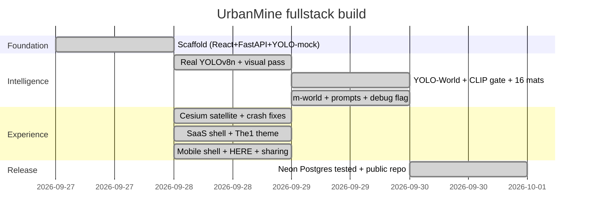

# UrbanMine — fullstack codebase document

Read this to understand the entire codebase: why it's built this way, what each
file owns, how the AI works, and how to run and share it. For day-to-day use,
start with `README.md`; for product and technical specs, see `PRD.md` / `TRD.md`
(local only, gitignored).

Measured snapshot: 15 tracked source files, ~2,100 lines of code (~130 KB),
plus docs. No dead demo links live here. Section 8 covers why localhost comes first.

## 1. Big picture

Demolition contractors photograph a site → AI identifies salvageable materials
with quantities → one click publishes marketplace listings → buyers search and
match by material, quantity, condition, and distance → requests → impact totals.

| Layer | Choice | Why it matters to you |
|-------|--------|-----------------------|
| Frontend | React 18 + Vite 5 | Instant HMR, dependency-free static build |
| Backend | Python + FastAPI | The AI ecosystem lives in Python; thin CRUD/scoring layer |
| AI | YOLO-World-m + YOLOv8n + visual pass + CLIP gate | Zero-shot materials, no training set needed |
| Store | `data.json` today, Neon Postgres + PostGIS tested | Haversian math now; `ST_DWithin` later, same rankings |
| Maps | CesiumJS satellite, HERE → Nominatim | Works keyless; keys only upgrade it |
| Sharing | here.now static + cloudflared tunnel | Laptop-hosted; localhost is the reliable path |

## 2. Framework decisions — why this, not the alternatives

**FastAPI, not MERN/Express.** The hardest problem is vision AI (torch,
ultralytics, transformers, PIL), all Python. Shelling Python out of Node adds
latency and failure modes; Pydantic covers validation.

**Postgres (+PostGIS path), not Mongo.** Matching is geo-first: radius queries
with GiST indexes plus a real relational ledger for requests. The JSON store
uses identical haversine math so rankings survive migration.

**React (Vite), not Next.js.** Dashboard with no SEO needs and heavy client
media (photos, WebGL). No router. Five tabs of conditional render.

**Cesium, not Leaflet.** Satellite-first presentation with an ion upgrade path
and one `createViewer` helper for both globes. Known cost on 1.119:
constructor imagery options are ignored and `removeAll()` strands tiles, so
layers attach post-construction via async factories.

**YOLO-World + YOLOv8n + CLIP, not training.** No labeled demolition dataset
exists. Open-vocabulary prompts beat day-one training; v8n covers COCO objects;
CLIP crop-gates household false positives. Training (YOLO11m) is the call once
hundreds of labeled site photos accumulate (`uploads/` holds the first ~40).

**HERE with Nominatim fallback.** Search must work keyless (rate-limited) and
scale keyed (India-biased); one helper pair owns the chain.

**here.now + tunnel, not permanent hosting (yet).** Static frontend publishes
in seconds; the backend stays on this machine. Permanent hosting needs a cloud
backend + database. That is the known next step, not this step.

## 3. Source map

```
urbanmine/
  README.md                         234 lines  Team runbook (flows, API, keys, sharing)
  PROJECT-FULLSTACK.md              this file
  PRD.md / TRD.md                   product + technical specs (gitignored, local only)
  LICENSE                           MIT
  docker-compose.yml                 15 lines   Optional PostGIS 16-3.4
  docs/urbanmine-flow.excalidraw.json           10-node MVP flow diagram
  backend/
    main.py                         798 lines  Routes, vision pipeline, scoring, store
    requirements.txt                 13 lines  fastapi, uvicorn, multipart, pydantic,
                                               ultralytics, pillow, numpy, transformers
    data.json                       auto       JSON store (seeded Bengaluru listings)
    uploads/                        auto       Analyzed photos, served at /uploads
  frontend/
    index.html                       16 lines   Cesium 1.119 CDN + font links
    vite.config.js                   18 lines   :5173, /api + /uploads proxy, HTTPS mode
    package.json                     23 lines   react, react-dom, gsap, exifr
    .env.example                               CESIUM / TILES / HERE / API_BASE template
    src/main.jsx                      6 lines   React root
    src/App.jsx                     596 lines  Shell + 5 panels + API consumers
    src/LocationPicker.jsx          266 lines  Coordinate-free picker + mini-globe
    src/cesium.js                   130 lines  Token, createViewer, flyTo, setPins
    src/styles.css                  178 lines  The1 tokens, flat cards, a11y
  scripts/
    publish-here.py                             Static publish (manifest → PUT → finalize)
    publish-pick.py                             Multi-publish slug picker
```

Key symbols. `main.py`: `MATERIAL_META` (16 materials), `FULL_QTY`,
`COCO_TO_MATERIAL`, `WORLD_PROMPTS` (descriptive, ~60) / `WORLD_NONCON` /
`WORLD_IGNORE` (hard negatives), `WORLD_CONF` (0.12), `yolo_infer` /
`world_infer`, `visual_estimate` (color + fabric + condition), `clip_check`
(gate 0.60, fail-open), `detect_materials` (merge, 100% shares, site verdict),
`_last_debug` (per-stage outputs for `?debug=1`), `match_score` (40/25/20/15),
`qty_for`, `haversine_km`, `downscale_for_ai`, schemas + routes. `App.jsx`:
`API`, `TABS`, `useIsMobile`, desktop/mobile shells, `UploadPanel`,
`MarketPanel`, `MatchPanel`, `RequestsPanel`, `ImpactPanel`,
`MATERIAL_PAINT`, `fmtINR`. `LocationPicker`: `AREAS` (12 presets),
`geoSearch`/`geoReverse` (HERE-first), tap + draggable pin.

## 4. Backend reference

Routes (base `:8000`, 404s are JSON): `GET /api/health` (yolo/world flags,
counts) · `POST /api/analyze` (multipart file + lat/lng/address/debug; 25MB
cap, format gate, always JSON) · `POST /api/listings` · `GET /api/listings`
(material, condition, q, lat/lng/max_distance_km, nearest-first) ·
`GET/PATCH /api/listings/{id}` · `POST /api/match` (top 20 by score) ·
`POST /api/requests` · `GET /api/requests` · `PATCH /api/requests/{id}`
(accepted/declined/pending) · `GET /api/impact` (tonnes = qty × CO₂ / 1000,
value formatted lakh/Cr, matches = 43 seed + live) · `GET /api/materials`
(all 16, drives the dropdowns) · static `/uploads` · docs at `/docs`.

Detection pipeline per photo: downscale to 1280px (original stored untouched) →
YOLO-World-m (91 prompts, conf 0.12) + YOLOv8n COCO in parallel, emitting
material hits with boxes plus non-construction objects → numpy color/texture
pass (bulk coverage, fabric detector, contrast condition; suppressed on
fabric/household frames) → CLIP verifies every World box and the full frame
(gate 0.60, strong COCO ≥0.50 trusted, fail-open) → fallback Concrete only on
construction-looking frames with nothing found, labeled as a guess →
confidences normalize to 100% shares, high to low. Site verdict = kept YOLO
evidence, or passing frame + ≥20% visual coverage.

Response: `detections[]` (material, icon, quantity, unit, condition,
confidence, share, price, source), `non_construction[]` (label, count,
confidence), `is_construction_site`, `model`. Proven controls: bedsheet
rejected, bus → Metal + people, brick stack → Bricks (6 verified boxes).

## 5. Frontend reference

Shell: desktop sidebar + mission topbar; mobile (≤900px hook) gets brand bar +
bottom tabs + full-width CTAs. Same panels/APIs both shells; GSAP
entrance-only, killed by `prefers-reduced-motion`. UploadPanel: dropzone +
camera snap, EXIF GPS, canvas shrink to 1600px JPEG, auto-analyze checklist,
editable detections, publish, non-construction section, not-a-site warning,
inline errors with retry. LocationPicker: search, presets, GPS, globe tap,
draggable pin, reverse-geocode on every move, compact mode. Marketplace:
location-driven filters, auto-reload, requests, pins, camera follows buyer.
A11y throughout: skip link, tablist roles, focus rings, alert/status regions,
labelled globes, no `alert()` popups.

## 6. Data flows

Upload → listing: photo → EXIF GPS (or picker) → shrink → analyze → edit →
confirm → live in Marketplace + match + impact. Match: buyer need (material,
qty, point, condition, radius) → scored rows with `distance_km`. Request:
buyer identity + listing → pending → contractor accepts/declines. Share build:
tunnel backend → build with `VITE_API_BASE` → publish `dist/` → link.
Anonymous links are immutable: each republish mints a new slug, and a
restarted tunnel breaks the baked address. Hence localhost-first.

## 7. Build timeline



The full MVP flow diagram lives in `docs/urbanmine-flow.excalidraw.json`
(open at excalidraw.com → Open).

## 8. Runbook

Local (the reliable path): backend with the **conda python**
(`/opt/homebrew/anaconda3/bin/python -m uvicorn main:app --port 8000`.
Plain `python3` lacks the AI deps), frontend `npm install` + `npm run dev`
(`:5173`). Mobile LAN: `HTTPS=1 npm run dev -- --host`, open
`https://<mac-lan-ip>:5173`, accept the self-signed cert. Share: tunnel the
backend, build with that URL as `VITE_API_BASE`, run `scripts/publish-here.py`.
Publish only on explicit approval, then record the slug. Env: ion token
(terrain), tiles asset ID (photorealistic 3D), HERE key (geocoder; Nominatim
fallback without), `DATABASE_URL` (real PostGIS).

## 9. Decision log and open items

Decided: FastAPI over Express (AI ecosystem); Postgres over Mongo (geo);
Cesium satellite over Leaflet (presentation, ion path kept); YOLO-World +
YOLOv8n + CLIP over training (no dataset yet); m-world over s-world (cleaner
boxes); descriptive prompts + hard negatives over generic; HERE-first
geocoding; 16 materials with live dropdowns; ranked 100% shares; honest
fallback labeling; `?debug=1` stage outputs; The1 theme; mobile shell with
bottom tabs; localhost-first sharing; public MIT repo.
Open: HERE/Cesium-ion API keys (user-held); trained segmentation model;
payments/auth/chat; real LCA factors; PostGIS cutover (Neon `database_q`
tested, PostGIS 3.6.4 verified); cloud backend so the demo survives this
machine sleeping.
